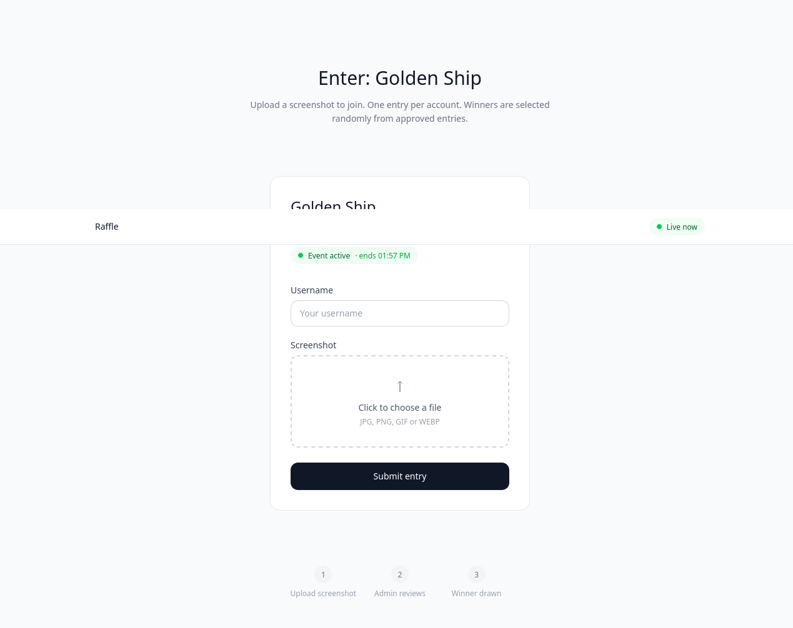

# Game Event Managment and Participation

A fullstack giveaway event managment platform. Admins schedule and activate an event, participants upload screenshots and a winner is selected either automatically or manually.





## Features

**Admin**
- Create, schedule, start and stop events.
- Moderate participant entries (approve / reject).
- Manual and automatic winner selection.
- Real-time pending entries overview.
- TOKEN-based admin authentication.

**Public**
- Submit a screenshot entry with a username.
- View current event status.

**Server**
- Entries are uploaded on Neon.
- Screenshots are uploaded on Cloudinary.


## Tech Stack

**Frontend:** React, Vite, TailwindCSS

**Backend:** FastAPI, Sqlalchemy, Alembic

**Database:** PostgreSQL(Neon)

**Storage:** Cloudinary

## Project Structure
```
game/
 - backend/ #FastAPI app, db_models, routes, services
 - frontend/ #React & Vite frontend
 - alembic/ # Database migrations
 - screenshots/ # README screenshots
```

## Environment Variables

To run this project, you will need to create a .env file in the root directory and add the following variables:


### Backend

`DATABASE_URL =`

`CLOUDINARY_CLOUD_NAME = `

`CLOUDINARY_API_KEY = `

`CLOUDINARY_SECRET_KEY = `

`ADMIN_SUPER_SECRET_KEY = `

### Frontend

Create a `frontend/.env` file and add 

`VITE_ADMIN_TOKEN = `


## Local Setup

### Prerequisites

- Python 3.12+
- Node.js 18+
- A [Neon](https://neon.tech) PostgreSQL database
- A [Cloudinary](https://cloudinary.com) account

### Backend

```bash
# Create and activate virtual environment
python -m venv venv
source venv/bin/activate

# Install dependencies
pip install -r requirements.txt

# Run database migrations
alembic upgrade head

# Start the server
cd backend
uvicorn main:app --reload
```

### Frontend

```bash
cd frontend
npm install
npm run dev
```

The API will be available at `http://localhost:8000` and the frontend at `http://localhost:5173`.

## API Documentation

Interactive docs available at `http://localhost:8000/docs` after starting the server.

## Roadmap
- JWT authentication for admin
- Input sanitization for username entries
