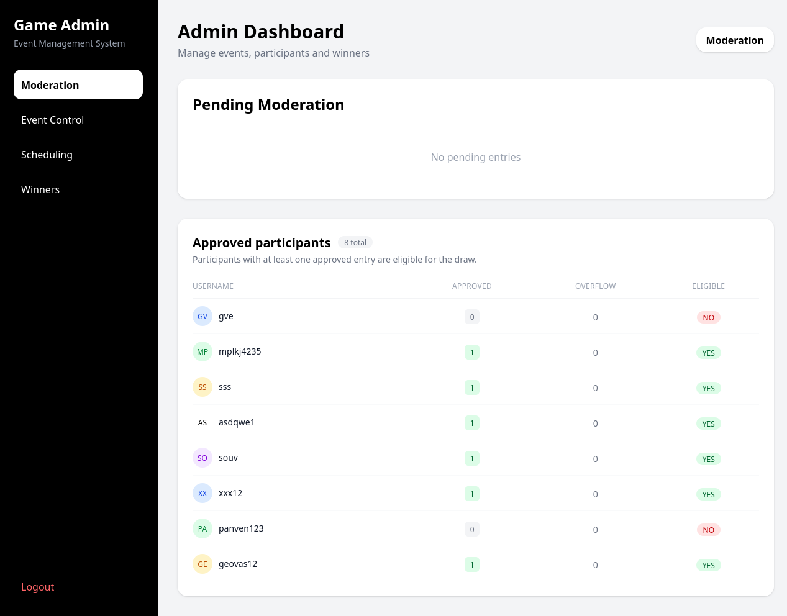
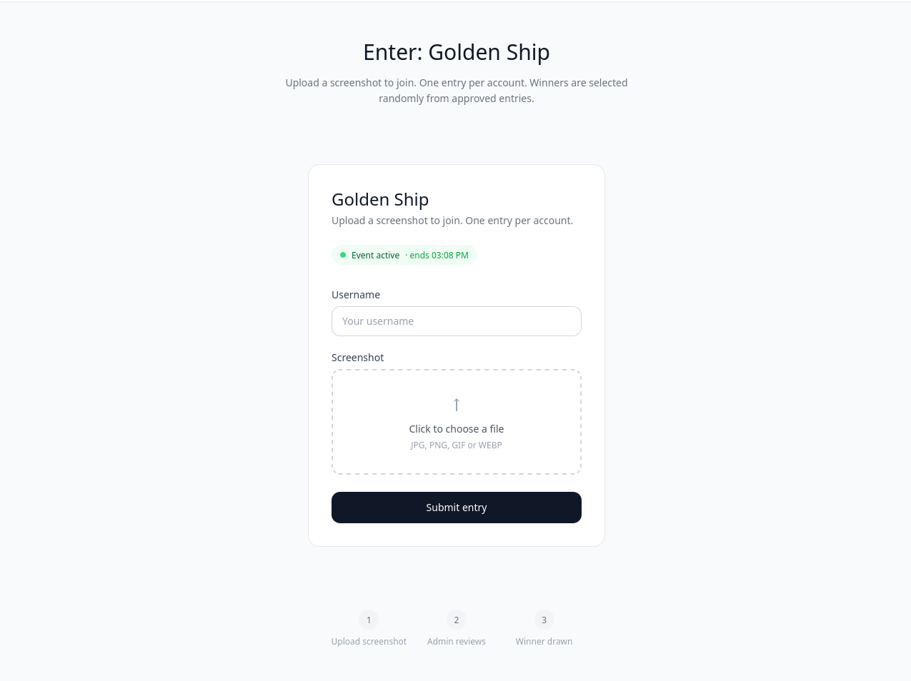
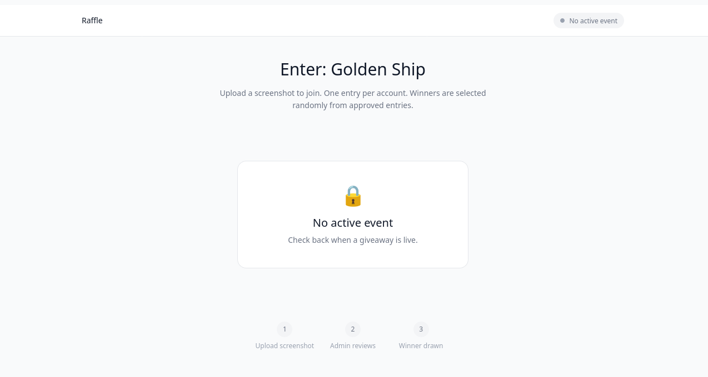
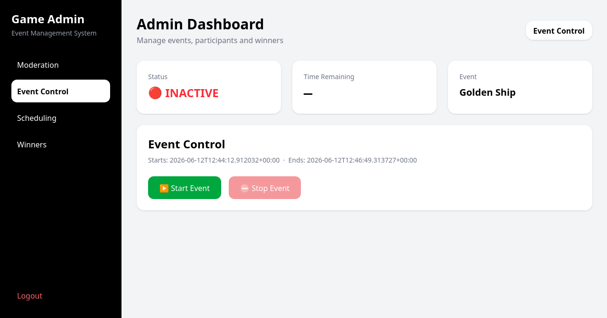
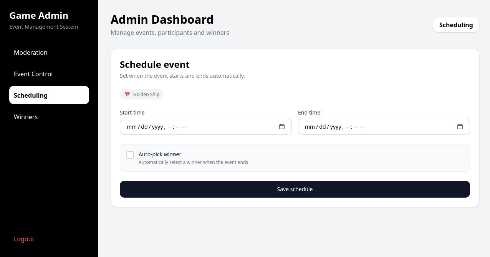
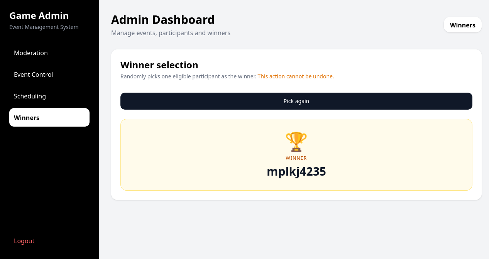

# Game Event Management and Participation

A full-stack event managment platform, which was built for a gaming community. Administrators can schedule and activate an event, participants upload screenshots and a winner is selected either automatically or manually.









## Features

**Admin**
- Create, schedule, start and stop events.
- Moderate participant entries (approve / reject).
- Manual and automatic winner selection.
- Real-time pending entries overview.
- JWT-based admin authentication (access & refresh tokens with versioning).
- Read-only demo admin account for recruiter and portfolio evaluation.

**Public**
- Submit a screenshot entry with a username.
- View current event status.

**Server**
- Participant entries are stored in PostgreSQL (Neon).
- Screenshots are uploaded and stored on Cloudinary.


## Tech Stack

**Frontend:** React, Vite, TailwindCSS

**Backend:** FastAPI, Sqlalchemy, Alembic

**Database:** PostgreSQL(Neon)

**Storage:** Cloudinary

## Project Structure
```
game/
 - backend/ #FastAPI app, db_models, routes, services
 - frontend/ #React & Vite frontend
 - alembic/ # Database migrations
 - screenshots/ # README screenshots
```

## Environment Variables

To run this project, you will need to create a .env file in the root directory and add the following variables:


### Backend

`DATABASE_URL =`

`CLOUDINARY_CLOUD_NAME= `

`CLOUDINARY_API_KEY= `

`CLOUDINARY_SECRET_KEY= `

`ADMIN_SUPER_SECRET_KEY= `

`JWT_SECRET_KEY=`

`ADMIN_USERNAME=`

`ADMIN_PASSWORD_HASH=`

`DEMO_ADMIN_USERNAME=`

`DEMO_ADMIN_PASSWORD= `

`ENVIRONMENT=`


## Local Setup

### Prerequisites

- Python 3.12+
- Node.js 18+
- A [Neon](https://neon.tech) PostgreSQL database
- A [Cloudinary](https://cloudinary.com) account

### Backend

```bash
# Create and activate virtual environment
python -m venv venv
source venv/bin/activate

# Install dependencies
pip install -r requirements.txt

# Run database migrations
alembic upgrade head

# Start the server
cd backend
uvicorn main:app --reload
```

### Frontend

```bash
cd frontend
npm install
npm run dev
```

The API will be available at `http://localhost:8000` and the frontend at `http://localhost:5173`.


## Demo Access

A read-only demo account is available for evaluation purposes.

Username: demo123
Password: 123demo

## API Documentation

Interactive docs available at `http://localhost:8000/docs` after starting the server.

### Authentication
The admin panel uses JWT authentication with short-lived access token and refresh tokens stored in HttpOnly cookies.

Two roles are supported for admin:
- `admin`- Full access to every administrative action.
- `demo`- Read-only access intended for portfolio and recruiter evaluation. Destructive actions such as approving or rejecting entries, scheduling events, starting or stopping events, and selecting winners are disabled both in the UI and on the backend

## Roadmap

### Completed
- JWT authentication with access and refresh tokens
- Role-based access control (`admin` / `demo`)
- Input sanitization for participant usernames
- Screenshot upload integration with Cloudinary

### Upcoming
- Multi-event support (separate API/DB per event, shared frontend)
- Per-user token versioning or session-based authentication

## Notes

This project is designed around a single administrator account. A separate read-only demo account is provided for portfolio and recruiter evaluation.
